# StarCraft II Coop Overlay (SCO)

This app looks for recent replays from StarCraft II Co-op, parses them and shows the information as overlay onscreen. The newly added user interface also provides additional information about games, players and other various statistics generated from user's replays. New features were added including commander randomizer or twitch bot for integration with my SC2 arcade maps.
 
The overlay can be added as another layer in Open Broadcaster Software (OBS) or other streaming software applications. It's fully customizable through simple editing of the HTML file. Its style can be changed, new functions or elements can be added to the visible overlay (images, text, etc).

For bugs, feedback and suggestions - [discord](https://discord.com/invite/FtGdhqD).

**Download links:**
* [Download here (GitHub)](https://github.com/FluffyMaguro/SC2_Coop_overlay/releases/download/2.31/SC2CoopOverlay.2.31.zip)
* Or run the script with Python 3.8 or newer:

```
pip install -r requirements.txt
python SCO.py
```


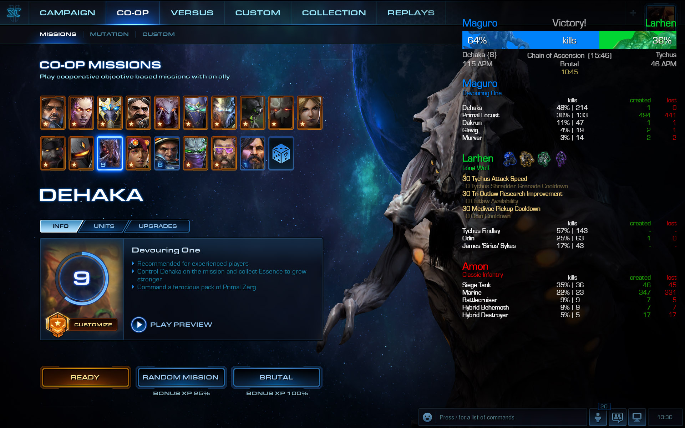

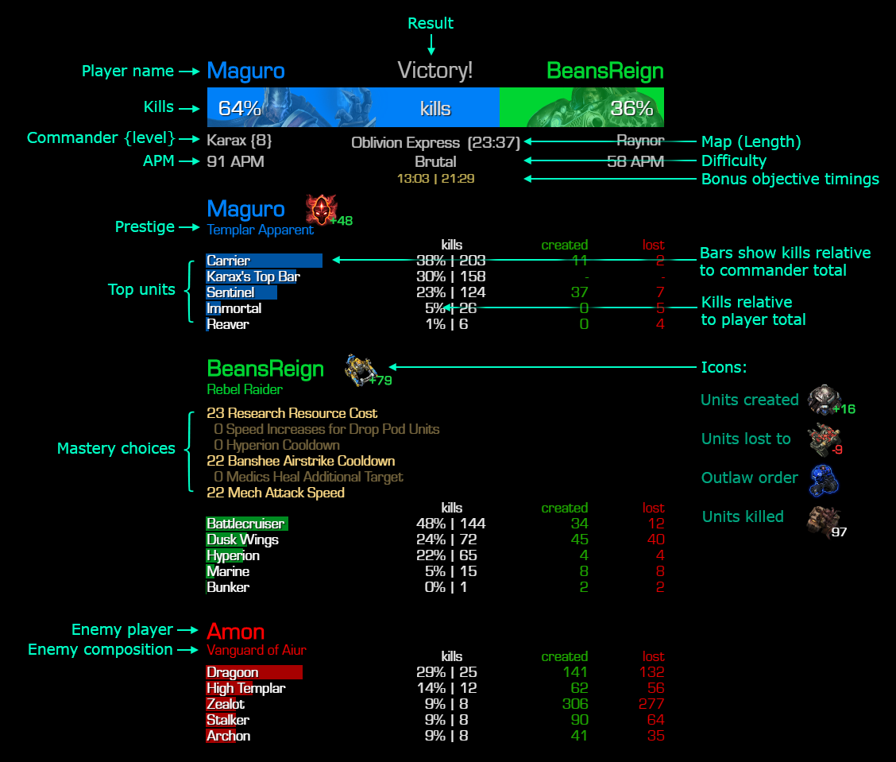

# How to use
1. Extract the archive
2. Run the executable (SCO.exe)
4. Some anti-virus programs are very sensitive to packaged python apps. If you have issues, add an exception to your anti-virus for the directory the app is in.
5. Use hotkeys or buttons in the app to control the overlay. It will show automatically after each game as well.
5. In StarCraft II set display mode to Windowed fullscreen (borderless)

To exit the app right click the icon in the system tray and click "Quit".

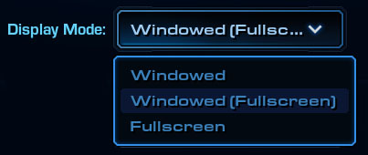


# OBS setup

If you are using game capture, you have to add overlay to OBS manually.


# The app
**Settings:**


**List of games you recently played:**

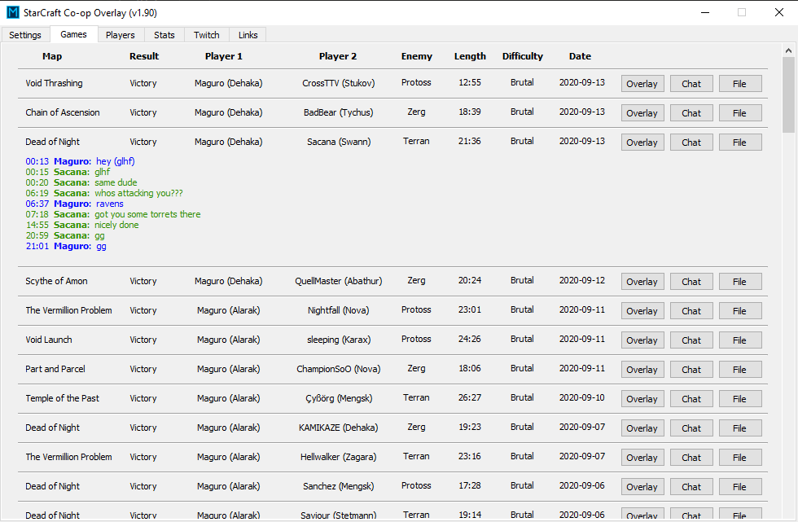

**List of players you played with:**

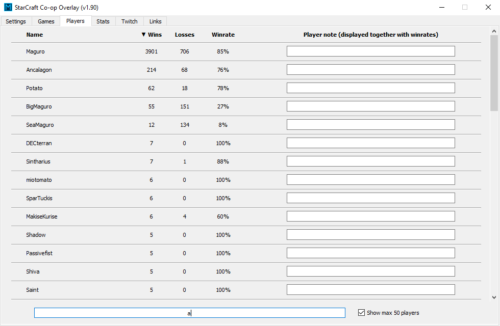

**Map statistics:**

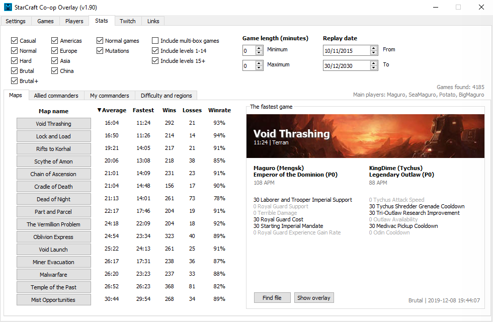

**Statistics for your and allied commanders:**

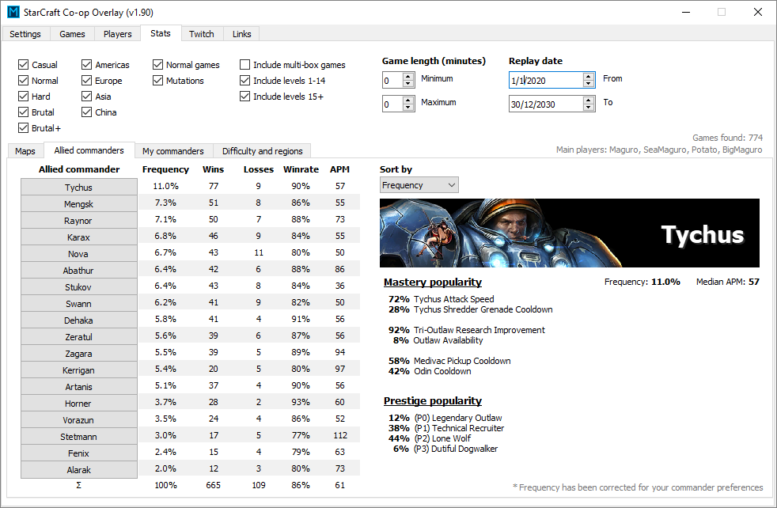

**Unit statistics:**

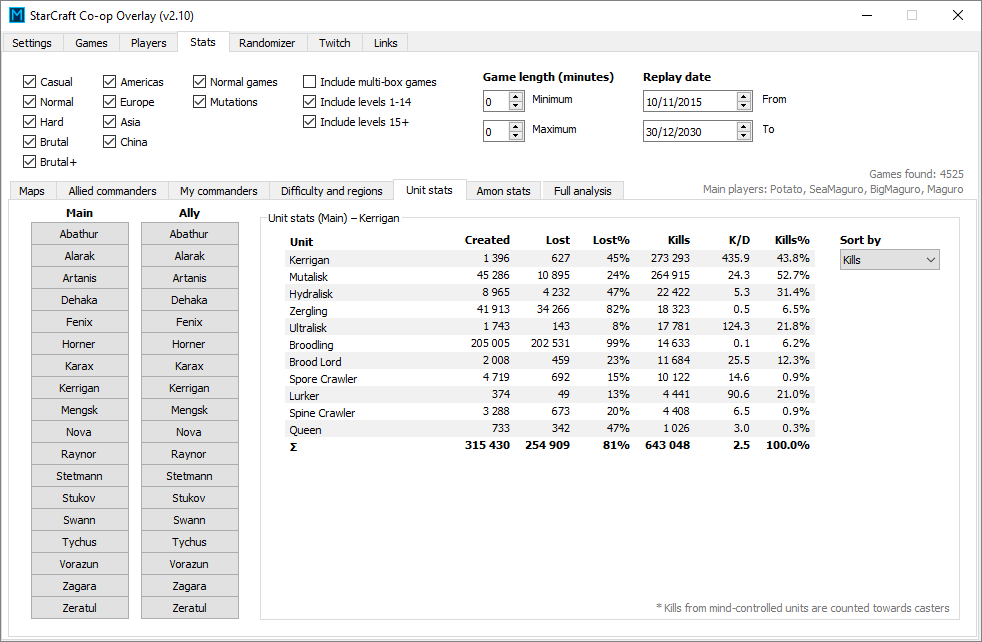

**Commander randomizer:**

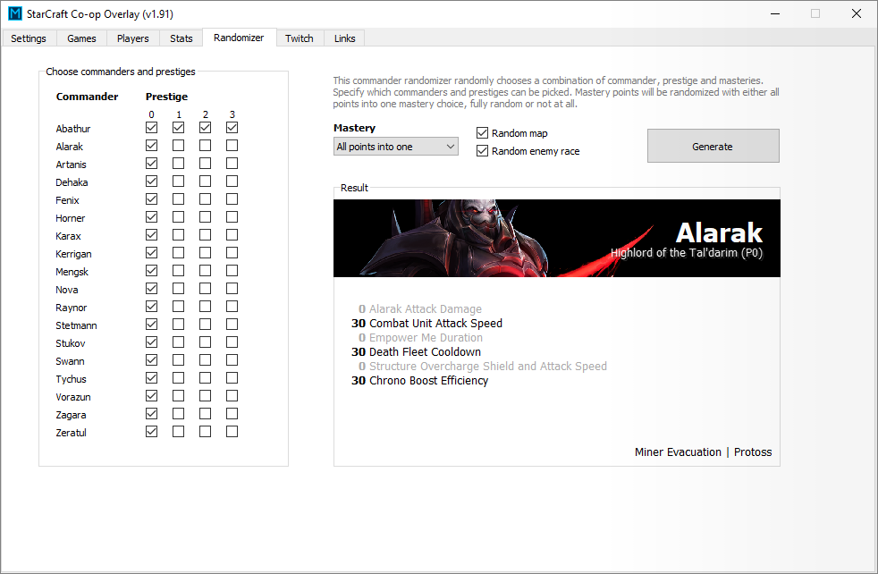

**At the start of the game, your record with your ally calculated based on your replays and matching his name is shown:**

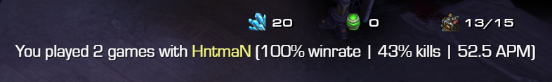

**Twitch chat overlay:**

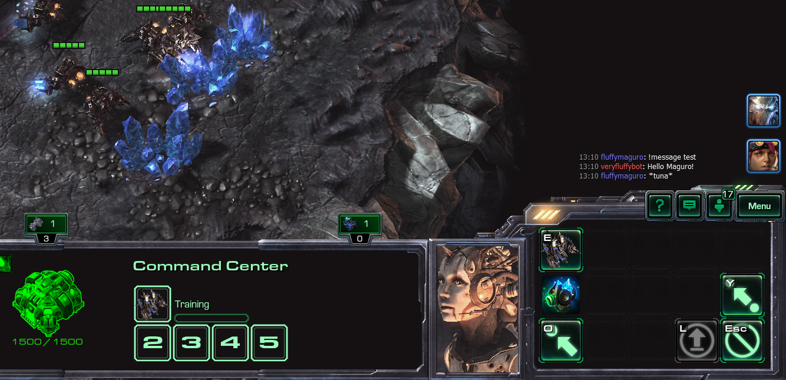

**Performance overlay:**

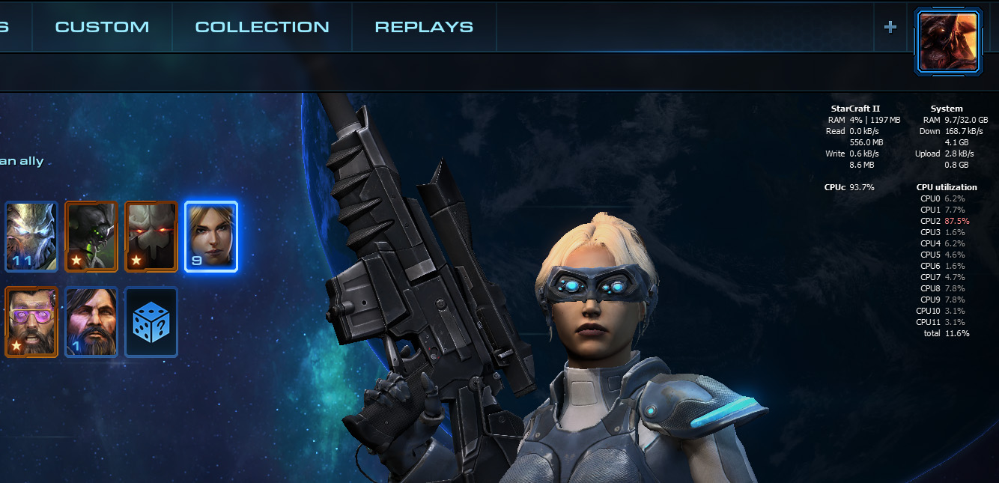
**And more...**


# Other notes
* The overlay targets Windows 10. It might not work correctly on older versions of windows (black background under overlay).
On Windows 7 enable aero theme and set “Enable Transparency” in “Window Color”.
* On MacOS or Linux run the script with "`sudo python3 SCO.py`" after installing required packages. It has been successfully tested on both MacOS and Linux, however every distribution and OS version has its own quirks.
* The app connects to the internet only at start to look for a new version, or if you setup automatic replay upload by filling in accout name and password.
* The app is not in conflict with Blizzard's Terms of Service. It uses official Blizzard's library (s2protocol) to parse replays, and what information StarCraft II provides while running.
* If you want it add it as overlay in OBS separatedly, add the HTML to your sources in OBS, and set its width and height to your screen resolution.
* You can edit the layout .html file. Changing its style through CSS (custom.css) or other functionality with javascript (custom.js).
* Indirectly killed Interceptors are counted towards player kills which is not the case in kills showed in-game. Directly killed interceptors are counted in both cases.


# Changelog

* 2.31 version

      - Reduced RAM usage
      - Merged cache files into one
      - Minor fixes and tweaks

* 2.30 version

      - Chat log shows when a player pings
      - Added a new checkbox "override folder selection" which forces showing stats for all replays regardless of a selected folder
      - All data can be dumped to a json file
      - Fixed stats for certain Abathur morphs
      - Kills from Glevig's and Murvar's spawns count toward Primal Pack Leaders
      - Kills from Broodlings count towards Kerrigan's & Stetmann's Brood Lords
      - Screenshot height fix
      - Fixed crashes during full analysis
      - Full analysis won't parse replays from the last session again
      - Added an option to custom javascript modification (in custom.js) to show units without kills

* 2.29 version

      - Easier bank management for twitch integration
      - Fixed stats for Primal Mutalisk

* 2.28 version

      - Overlay won't show in games where no commanders were found
      - Fixed a bug with mutator identification
      - Updated libraries

* 2.27 version

      - Fixed duration setting not working properly
      - Fixed monitor setting not working properly
      - Updated s2protocol

* 2.26 version

      - Bug fixes and tweaks

* 2.25 version

      - Counted the total number of mind-controlled units
      - Fix for mutator identification
      - Number of games shown in unit stats
      - Updated s2protocol

* 2.24 version

      - Fix for mutator identification

* 2.23 version

      - Mutators identified in custom mutators and MM maps
      - custom.js and custom.css are not overriden after an update
      - Weekly mutations and custom mutators shows difficulty
      - Small fixes and tweaks

* 2.22 version

      - Player kills limited to Amons units
      - Amon kills limited to player units
      - SC2 process isn't checked when overlay is not visible
      - Mengsk Prestige 3 kills properly counted
      - Swann's Siege Tank and Thor and Kerrigan's Torrasque losses counted properly
      - Twitch bot won't fail when the channel name is capitalized
      - Better identification for bonus objective completion on Malwarfare
      - Small tweaks and fixes


* 2.20 version

      - Twitch bot works now with after filling up the channel name
      - Twitch chat available as overlay
      - You can search through replays
      - New performance monitoring available as overlay
      - Salvaged units aren't counted as losses
      - Improved scaling for high DPI displays
      - App cannot be started multiple times
      - Small tweaks and fixes


* 2.10 version

      - Frequency added to maps
      - Maps can be sorted
      - Last ally showed in the player tab on top and is colored
      - Checkbox for showing/hiding session information
      - Randomized commander & prestige can be shown on the overlay
      - Part and Parcel bonus identification fixed
      - More replays are parsed successfully
      - More accurate replay analysis
      - Player info doesn't show for versus games
      - Option for full analysis added. Running it will take long time, but it will provide more accurate game lengths and more stats
      - Added new stats related to player and unit kills, and bonus objective completion. These require full analysis
      - Default hotkeys changed to be less likely pressed by accident
      - Fancy changelog

* 2.00 version

      - Revamped interface (settings, game list, player list, stats, links)
      - Integrated commander & map randomizer
      - Integrated control for twitch both to connect to MM maps
      - Bonus objectives show when they have been completed
      - Easy updating to new versions
      - App will survive sleep & awake better
      - Fixes for certain bugs causing crashes and unreponsivness
      - New hotkey to show player winrates
      - Map name is always reported in English
      - Improved replay analysis for non-english replays
      - Updated for Zagara mastery changes
      - Abathur's Swarm Hosts show kills separate from normal Locusts      
      - Artanis top bar kill counts are more accurate, Unbound Fanatics count towards the top bar
      - Many other tweaks and fixes


* 1.18 version

      - Commander images are shown in the background of the killbar
      - In mixed difficulties, the order reflects which player queued for what difficulty
      - On MM maps commander level isn't shown as 1
      - Minor fixes and tweaks


* 1.17 version

      - You can add notes to players that will show together with the winrate and games played
      - H&H Mag-mines are shown separately and kills are correctly counted
      - Fixed random enemy units showing in your units stats
      - Fixed respawning heroes showing one more death and creation
      - Fixed player winrate data occasionally showing for the previous player
      - Fixed player winrate showing in menus
      - Fixed some issues with primal combat and morphs
      - Minor fixes and tweaks


* 1.16 version

      - Masteries show only when players have them
      - Showing all difficulties (Casual/Normal/Hard/Brutal)
      - Showing commander level if it's under 15
      - Fixed various issues preventing the app from working
      - Visual tweaks
      - Updated s2protocol


* 1.15 version

      - Support for prestige talents
      - Showing Strike Platforms built, Unbound Archons created, and Artifacts collected
      - At the start of each game, the app can show the number of games with your ally and winrate
      - Better player name guess with above activated
      - Small visual tweaks
      - Parser is now using just s2protocol to parse replays
      - Better behavior when write permissions are denied by antivirus


* 1.14 version

      - The number of created Infested Bunkers and Mecha Infestors is shown as icons
      - Gary won't show created and lost numbers as they are not accurate (as with Tychus' outlaws)
      - Odin's precursor no longer counted for created & lost numbers
      - Perdition and Devastation Turrets renamed to Flaming Betties and Blaster Billies
      - Easier customization via separate CSS and JS files for custom modifications
      - Internal reorganization of dictionaries, and many comments added to the code
      - Proper HH:MM:SS format for game length for games over 60 minutes
      - Minor visual tweaks


* 1.13 version

      - Additional icons showing structures destroyed on Dead of Night and certain mutator kills:
        Void Rifts, Propagators, Void Reanimators, Turkeys, Mines, HftS & TUS, units sacrified to Killbots
      - APM rescaled according to accurate replay length
      - Stats no longer contain events that happened during victory cutscenes (e.g. Cradle of Death)
      - Tweaks to replay analysis (Nova airstrike,...)

* 1.12 version

      - Masteries identified in [MM] maps
      - Automatic identification of preferred players if none are specified
      - Game length more accurate and close to speedrunning times instead of the replay length
      - Better way to find documents folder
      - Tweaks to enemy composition identification
      - Small fixes for replay analysis in custom mutations

* 1.11 version

      - Identifying enemy unit composition (best guess)
      - By default there is a single key to show/hide overlay (possible to change by user)
      - Minor graphical tweaks

* 1.10 version

      - Multimonitor support
      - Showing Outlaw order for Tychus
      - Start up notification shows hotkeys and if an update is available
      - Shows games even without any kills

* 1.9 version

      - It's now possible to view analysis of older replays and switch between them freely
      - Fixed the issue where the replay folder wasn't located correctly on certain systems
      - Replay analysis tweaked for more accurate stats
      - Overlay shows map played & winrate in the current session
      - Minor graphical tweaks
      - Small tweaks to sc2reader module to prevent load fails

* 1.8 version

      - Replay analysis tweaks and improvements
      - Start up notification
      - Better logging
      - Bug fixes

* 1.7  version

      - Colors can be changed via the config file
      - Bug fixes

* 1.6 version

      - Replays can be automatically uploaded to https://starcraft2coop.com

* 1.0 – 1.5 initial versions


# Config file

**Twitch bot** can be set up in this way.
*bot_oauth* has to be generated by twitch for example [here](https://twitchapps.com/tmi/). It's also possible to change in the config file greetings, banned units and mutators, and reponses to user commands.


```
  "twitchbot": {
    "channel_name": "fluffymaguro",
    "bot_name": "veryfluffybot",
    "bot_oauth": "oauth:r8b5...............",
    "bank_locations": {
      "Default": "C:/Users/Maguro/Documents/StarCraft II/Accounts/114803619/1-S2-1-4189373/Banks/1-S2-1-4189373/MMTwitchIntegration.SC2Bank",
      "Local": "C:/Users/Maguro/Documents/StarCraft II/Banks/MMTwitchIntegration.SC2Bank",
      "EU": "C:/Users/Maguro/Documents/StarCraft II/Accounts/452875987/2-S2-1-7503439/Banks/2-S2-1-1174830/MMTwitchIntegration.SC2Bank"
      },

      ...

   }
```

You can change the **number of recent games** visible in the game tab.
Default it 100 games.

```
"list_games": 100,
```
You can change the **offset from the right side of the monitor**.
Negative values mean more to the left.

```
"right_offset": 0,
```

You can change the **font size** by a relative scaling factor. Default is 1.

```
"font_scale": 1,
```